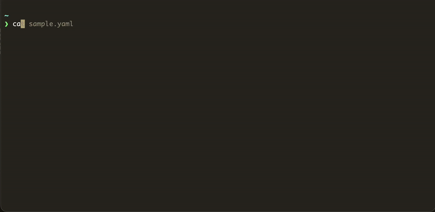

# ReqCorder

ReqCorder is a CLI tool for Linux and macOS to perform and record HTTP requests using YAML files, authored in Go. The main goal of the tool is to provide a clean CLI interface for maintaining request-response history and traceability, particularly useful for API testing.



## Salient Features

- Create reusable request templates in YAML that ReqCorder will use to perform HTTP requests ♻️.
- Embed environment and YAML variables in the request 🌐.
- View responses history for a particular template or request 📕.
- Compare two templates, requests, or responses ➕➖.
- View specific templates, requests, or responses 🔍.

## Installation

- Download the necessary .tar.gz from the releases section.
- Untar the file. Example -

```bash
tar -xzf reqcorder-linux-arm64.tar.gz
chmod +x reqcorder
```

- Move the extracted binary to an appropriate location, ideally covered in the PATH. Example -

```bash
mv reqcorder /usr/local/bin
```

- Alternatively, one can modify the PATH variable to include the location where ReqCorder was extracted.

## Usage

### Basics

- ReqCorder requires YAML file templates to perform requests. Please refer to the `samples` folder in the repository for few examples of said files.

- The file passed in during `exec` invokes is considered as the template file by ReqCorder. ReqCorder distinguishes templates from requests ie requests are objects which are used once the validation, preparation, and variable substituion steps are completed.

- Supported commands -

```bash
# version
reqcorder version    
ReqCorder version v0.0.1

# help
reqcorder help
Usage of ReqCorder:
reqcorder <subcommand> [flags] [args]

Subcommands:
  diff     Compare two templates, requests, or responses
  show     Display a specific template, request, or response
  exec     Execute HTTP request from a template file
  list     List templates, requests, or responses in the store

Run "reqcorder <subcommand> --help" for more details.

# exec
reqcorder exec --help              
Usage of exec:
reqcorder exec [--min|-m|--quiet|-q] <template_path> [--verbose|-v]
  -m Only show response body and recording info on stdout (shorthand)
  -min
     Only show response body and recording info on stdout
  -q No output on stdout (shorthand)
  -quiet
     No output on stdout

# list
reqcorder list --help
Usage of list:
reqcorder list [-n] (templates|requests|responses) [-template|-tp|-request|-rq] [--verbose|-v]
  -n uint
     Limit of records to list (default 10)
  -request string
     Request hash filter
  -rq string
     Request hash filter (shorthand)
  -template string
     Template hash filter
  -tp string
     Template hash filter (shorthand)

# show
reqcorder show --help
Usage of show:
reqcorder show (-template|-tp|-request|-rq|-response|-re) <value> [--verbose|-v]
  -re string
     Response ID (shorthand)
  -request string
     Request hash
  -response string
     Response ID
  -rq string
     Request hash (shorthand)
  -template string
     Template hash
  -tp string
     Template hash (shorthand)

# diff
reqcorder diff --help
Usage of diff:
reqcorder diff (templates|requests|responses) -s <source_identifier> -t <target_identifier> [-i|-inline] [--verbose|-v]
  -i Inline diff (shorthand)
  -inline
     Inline diff
  -s string
     Source (shorthand)
  -source string
     Source
  -t string
     Target (shorthand)
  -target string
     Target
```

### Performing Requests using ReqCorder

- Prepare your template YAML file (For YAML reference, refer [Template YAML Reference](#template-yaml-reference))
- Use the `exec` command as follows -

```bash
reqcorder exec ./my_template.yml
```

- ReqCorder will then output the store information at the end (Applies only to min and default modes). Example -

```bash
Done 
Response ID - 20251026_074004_000_0001
Request hash - 2b8e5fa2587703f8de674c8b22ad590b
Template hash - dacf1342de1d5d91628682df138d6f66
```

This information can then be used in the other commands of ReqCorder.

- Note - If a client error occurs during request execution, ReqCorder will store the response with status code 1000.

### Listing Artifacts

- For listing templates, requests, or responses, use the `list` command -

```bash
reqcorder list templates
reqcorder list requests 
reqcorder list requests -tp <template_hash> # Filter by template hash
reqcorder list responses 
reqcorder list responses -tp <template_hash> # Filter by template hash
reqcorder list responses -rq <request_hash> # Filter by request hash
```

### Inspecting A Specific Artifact

- For inspecting a specific template, request, or response, use the `show` command -

```bash
reqcorder show -tp <template_hash>
reqcorder show -rq <request_hash>
reqcorder show -re <response_id>
```

### Comparing Two (Similar) Artifacts

- ReqCorder supports comparing two templates, two requests, or two responses
- Use the `diff` command to compare two artifacts -

```bash
reqcorder diff templates -s <source_template_hash> -t <target_template_hash>
reqcorder diff requests -s <source_request_hash> -t <target_request_hash>
reqcorder diff responses -s <source_response_id> -t <target_response_id>
```

### Template YAML Reference

- Supported keys -

```yaml
url: A valid URL for this request.
# url: https://example.com

method: Request method. Supports GET/POST/PUT/PATCH/DELETE/HEAD/OPTIONS.
# method: GET

headers: Key-value pairs representing the request headers.
# headers:
#    key1: value1
#    key2: value2

cookies: Key-value pairs representing the request cookies.
# cookies:
#    token: my-token
#    cookie2: cookie2

auth_type: Auth type for this request, if any. Supports Basic/Bearer. ReqCorder will prefix with Basic/Bearer in case the prefix is missing in 'auth' key. Omit if not one of them.
# auth_type: bearer

auth_header_name: Auth header name. Defaults to Authorization.
# auth_header_name: Not-Authorization

auth: Auth header value.
# auth: my_auth_token

user_agent: User agent for this request. Defaults to ReqCorder.
# user_agent: Chrome

body: Request body. Supports embedding environment variables using 'env:<NAME>' and body_vars using {{body_var_name}}.
# body: |
#   {
#     "username": "{{user_name}}",
#     "id": 1,
#     "body": "bar",
#     "shell": "{{env:SHELL}}"
#   }

# Examples for auth:
# For Basic auth (will become "Basic dXNlcjpwYXNz")
# auth_type: Basic
# auth: user:pass

# For Bearer auth (will become "Bearer my_token")
# auth_type: Bearer
# auth: my_token

timeout: Timeout for the request in seconds. Defaults to 30.
# timeout: 60

body_vars: Key-value pairs representing body variables that'll be substituted in the body.
# body_vars:
#   user_name: "john_doe"

ssl_verify: Whether SSL verification should be turned on or off for this request. Defaults to true
# ssl_verify: false

ca_cert_path: Path to the CA certificate for this request
# ca_cert_path: /home/myuser/cert.pem
```

### Configuration

- By default, ReqCorder writes the logs and artifacts to current user's home directory -

```bash
ls ~/.reqcorder                      
logs store
```

- If one wishes to change this location, they can set the `REQCORDER_HOME` variable -

```bash
export REQCORDER_HOME=/home/myuser/store
```
